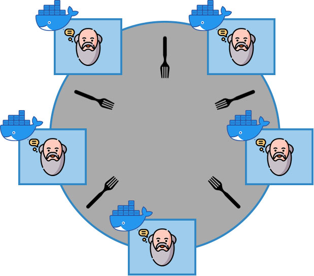

# Distributed Dining Philosophers Problem
This repository contains an implementation for solving the classic Dining philosophers problem in a peer-to-peer (P2P) environment, using the Ricart-Agrawala Algorithm for mutual exclusion with the Roucairol-Carvalho optimization along with Lamport's Logical Clocks and a G-Counter a Conflict-free replicated data type(CRDT) for counting the number of spaghetti meals eaten.
   <p align="center"> 
  
</p>

Sources:
- *https://www.flaticon.com/free-icon/philosophy_2178189*
- *https://www.freepik.com/icon/fork-diagonal_45433*

## Overview
The Ricart-Agrawala algorithm with Lamport clocks is a distributed mutual exclusion algorithm used in a distributed computing environment to coordinate access to shared resources, such as forks in the context of the dining philosophers problem. This algorithm ensures that multiple philosophers can safely access a shared resource without causing conflicts or data corruption.

In this implementation, the philosophers can be executed either locally on different machines in the same network or within the provided Docker environment, allowing for distributed execution. Each philosopher in the system follows a set of rules:
1.  **Initial Thinking**: Every philosopher starts by thinking for some time, simulating their idle state.

2.  **Requesting Forks**: When a philosopher decides to eat, they request the left and right forks from their neighboring philosophers. In a distributed setting, this involves sending a request message to their neighbors.

3.  **Waiting for Responses**: The philosopher cannot start eating until both their left and right neighbors have responded to their fork request. This means that the philosopher must receive acknowledgment messages from both neighbors before proceeding to eat.

4. **Eating**: Once the philosopher has received acknowledgment messages from both neighbors, they can start eating. The philosopher will eat for some time, simulating their critical section.

5. **Roucairol-Carvalho Optimization**: This optimization allows a philosopher to eat again if neither their left nor right neighbor has requested a fork within the interval of two eating periods. This helps to avoid unnecessary waiting and contention for forks.

6. **Handling Concurrent Requests**: If a neighbor sends a request while the current philosopher is in the critical section the request gets deferred. When a philosopher is also in the requesting process, several conditions are checked:
    - The request is deferred if the timestamp of the receiving philosopher's request is smaller. This ensures that the philosopher with the lower timestamp gets priority.
    - If the timestamps of the requesting philosopher and the receiving philosopher are equal, the request is also deferred if the receiving philosopher has a lower ID. This further prioritizes requests based on the philosopher's ID.

   Additionally, if a philosopher receives a request while not in the critical section and not currently requesting forks, they immediately send back a reply in response to the received request.


7. **Releasing Forks**: Once the philosopher has finished eating, they release their forks and send acknowledgment messages to their neighbors. In a distributed setting, this involves sending a release message to their neighbors.
## Usage
### Local Network Setup
1. Build the project using Maven:
```sh  
mvn clean install  
 ```
2. Locate the `ddpp-1.0.jar` file inside the `taget` folder.  
3. Start the simulation:  
 ```sh  
java -cp ddpp-1.0.jar Application <PhilosopherID> <LocalServerPort> <LeftNeighborHostAddress> <LeftNeighborPort> <RightNeighborHostAddress> <RightNeighborPort>  
 ```
### Docker Setup  
1. In the same folder as the Dockerfile run:  
```sh  
docker build -t ddpp:latest
```  

2. Generate the docker-compose file using:  
```sh  
java src\main\java\GenerateCompose.java <NumberOfDockerContainers> <InitialServerPort>      
  ```
Note: The initial server port is used to incrementally set the ports for the other containers.
3. Start the Docker containers using:
 ```sh  
docker-compose -f docker-compose.yml up -d --remove-orphans  
 ```
4. To stop the simulation run this command:
```sh  
docker-compose -f docker-compose.yml down  
 ```  

# License
This project is licensed under the MIT License. See the LICENSE file for details.


## Sources
- https://en.wikipedia.org/wiki/Conflict-free_replicated_data_type
- https://en.wikipedia.org/wiki/Ricart%E2%80%93Agrawala_algorithm
- https://en.wikipedia.org/wiki/Lamport_timestamp
